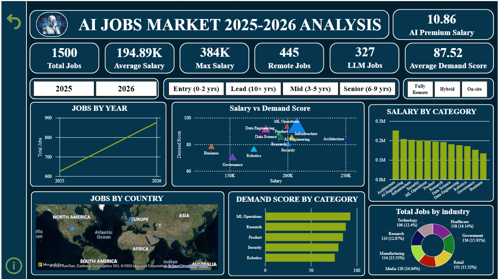

# AI Jobs Market Analysis Dashboard (2025–2026) – Power BI Project

## 🎯 Project Overview
The **AI Jobs Market Analysis Dashboard** is a Power BI project designed to analyze AI job market trends for **2025–2026**. The dashboard provides interactive visualizations and insights into **job opportunities, salary distribution, demand scores, industry demand, experience-level requirements, remote work opportunities, and geographic job distribution**. It helps users identify **high-demand roles, top industries, and key locations** for AI professionals.

---

## 🗃️ Dataset Information
The dataset contains AI job market data with fields such as:

- Job ID, Job Title, Job Category  
- Experience Level, Years of Experience, Education Required  
- Annual Salary, Salary Min and Max  
- Country, Remote Work Type, Company Size, Industry  
- AI Salary Premium Percentage, Demand Score, Demand Growth YoY %  
- Benefits Score, Posting Year and Month, Senior Role Indicator, Remote Friendly Indicator, LLM Role Indicator, Salary Tier  

The dataset was **cleaned, transformed, and modeled** before building the dashboard.

---

## 🎯  Project Objectives
- Clean and transform raw AI job market data  
- Build a proper data model  
- Create **Interactive dashboards** using Power BI visuals  
- Implement **DAX measures** for KPIs and metrics  
- Analyze trends in **salary, demand, and job distribution**  
- Enable navigation using **bookmarks and buttons**  
- Provide actionable insights into the AI job market

---

## 🧹 Data Cleaning & Transformation
Data preparation steps included:

- Removing unnecessary columns  
- Handling missing values  
- Correcting data types  
- Creating calculated columns and DAX measures  
- Building relationships between tables  
- Categorizing salaries into tiers  
- Verifying location data for mapping visuals

---

## 🧮 Key DAX Measures
- Total Jobs  
- Average Salary  
- Maximum Salary  
- Minimum Salary  
- Average Demand Score  
- Average AI Salary Premium  
- Remote Jobs Count  
- LLM Jobs Count  
- Jobs by Experience Level  
- Jobs by Industry  
- Jobs by Country  

---

## 📈 Dashboard Features

### 🎯 KPI Cards
- Total Jobs  
- Average Salary  
- Remote Jobs  
- LLM Jobs  
- Average Demand Score  
- Average AI Salary Premium  

### 🎛️ Slicers / Filters
- Posting Year  
- Experience Level  
- Remote Work Type  

### 📊 Visualizations
- Line Chart – Job trends over time  
- Bar Chart – Salary by job category  
- Bar Chart – Demand score by job category  
- Column Chart – Jobs by salary tier  
- Donut Chart – Jobs by industry  
- Map – Jobs by country   
- Scatter Chart – Salary vs Demand Score  
- Stacked Bar Chart – Remote jobs by experience level  

---

## 📑 Navigation & Bookmarks
Interactive navigation using **bookmarks and buttons**:

- Reset Filters  
- Info Page  

---

## 📌 Key Insights
- AI job demand is **increasing over time**  
- **Senior-level jobs** offer higher salaries than entry/mid-level roles  
- Remote jobs constitute a significant portion of AI opportunities  
- Certain industries provide **higher demand scores and salary premiums**  
- High salary tier jobs are fewer but offer **higher AI salary premiums**  
- Certain countries have **more AI job opportunities** than others  
- Job categories like **Machine Learning, Data Science, and AI Engineering** show high demand and salary levels

---

## 🧰 Tools & Technologies
- **Power BI Desktop**  
- **Power Query** (Data Cleaning & Transformation)  
- **DAX (Data Analysis Expressions)**  
- Data Modeling  
- Interactive Dashboard Design  

---

## ▶️ How to Use the Dashboard
1. Use **slicers** to filter data by year, job category, industry, experience level, and remote work type    
2. Click **Reset Filters** to clear all selections  
3. Hover over visuals to view **detailed tooltips**  
4. Use the **map** to analyze geographic job distribution  

---

## ✅ Project Outcome
This project demonstrates skills in:

- Data cleaning and transformation  
- Data modeling and DAX calculations  
- Interactive dashboard design  
- Extracting actionable insights from AI job market data  

The dashboard provides a **comprehensive analysis of AI job trends, salary distributions, and demand across industries and locations**.

---

## 📊 Dashboard Preview  

---

## 🔗 Connect With Me  
- 💼 LinkedIn: www.linkedin.com/in/sadiya-ansari-a44274319
- 💻 GitHub:  https://github.com/Sadiya6767

---

## 🏷️ Tags  
#DataAnalysis #Excel #Dashboard #BusinessIntelligence #DataVisualization #SalesAnalytics  

---

⭐ *Turning raw data into meaningful business insights.*
